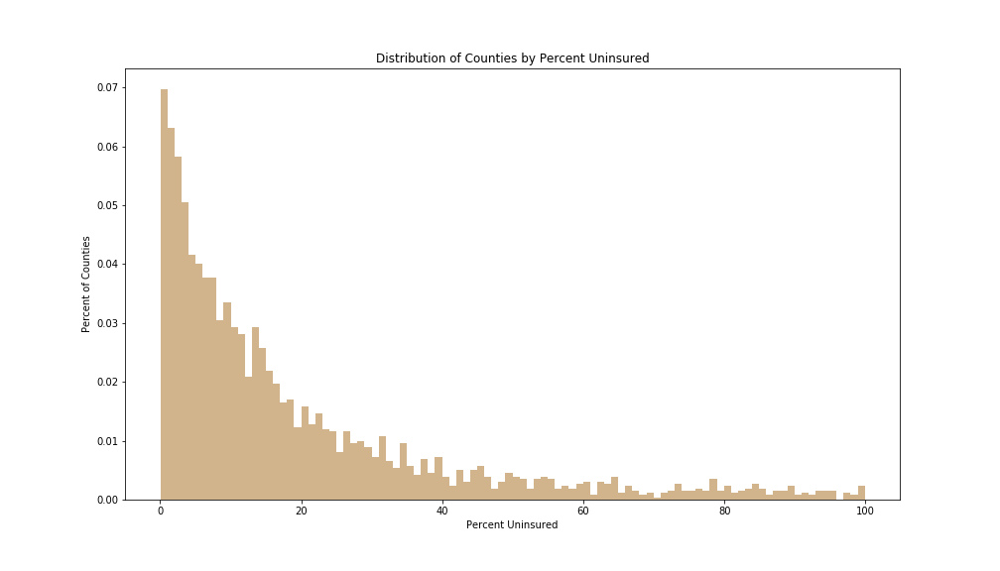
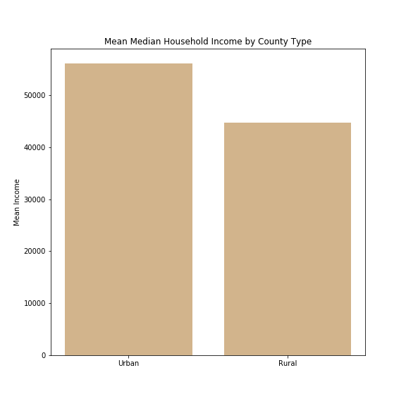

# The Rural Uninsured: Driving Factors & Implications

## Introduction

According to recent census data, 8.8 percent of people in the United States do not have health insurance. That's 28 million people who may receive substandard medical care or be turned away due to their lack of status. Because the United States does not have nationalized healthcare, citizens rely on health insurance to cover medical expenses. There are a wide variety of coverage types offered by both private companies and public healthcare systems like Medicare and Medicaid. Rates of uninsured were at 18% before the Affordable Care Act (ACA) mandate in 2013. 

## The Problem

For the patient, being uninsured means that you may be turned away for your inability to pay or you may receive substandard medical care (fewer tests, less attention from the physician, etc). If the reason is severe, you may have to accumulate bad debt (knowingly using credit you will not be able to repay) to ensure you can access care. For the physician, you must balance the ethical implications of turning away patients for a lack of finances and the steps you may have to take to lessen their burden, for example, underwriting fees, exaggerating symptoms, or sending them to a publicly funded alternative. 

## The Model

I have created a model that takes in **demographic features** (including rural/urban populations, poverty rates, and education level) and **community health indicators** (including the presence of community health centers and if the county is undersevered by medical infastructure). This linear regression model will allow us to comment on what features impact the rate of uninsured by county. 

### Data Collection & Cleaning

I concatenated four datasets for this project to flush out some of my hypothesized features. I started with a community health indicators set from [HealthData.gov](https://healthdata.gov/dataset/community-health-status-indicators-chsi-combat-obesity-heart-disease-and-cancer). Then I incorporated a few datasets from the Census Bureau to get median household income ([1](https://www.census.gov/topics/income-poverty/income/data/tables.html)), demographics ([2](https://data.world/exercises/linear-regression-exercise-1)), and rural vs urban breakdowns ([3](https://www.census.gov/programs-surveys/geography/guidance/geo-areas/urban-rural/2010-urban-rural.html)).

I imputed missing values for each county's community health indicators based on the average of the corresponding state. I had to drop some rows due to some of the four sets treating United States' territories as county-equivalent and some remote counties not having data collected. 

Finally, statistical tests were conducted to elucidate some differences between rural and urban counties. The rate of uninsured, median household income, presence of community health centers, and if that county was medically underserved were all significantly different between rural and urban counties.

 

While a majority of counties have less than ten percent uninsured (about the national average), there are many counties with much higher rates. Many of these are very lightly populated and rural. 

### Feature Engineering/Selection

I removed correlated features, and feature engineered interaction features between the presense of community health centers and if the county was medically underserved against the urban population. I hypothesized that a rural county would respond differently to these factors than an urban county. 

I used recursive feature elimination to remove insignificant features. 
 
## Insights

We previously discovered that rural counties have a disproportionately high rate of uninsured (20% vs 9%). 

 

But what factors influence this rate? After running our linear regression, we were able to determine that a mixture of community health indicators and demographic factors had a significant effect on the rate of uninsured. A high percentage of smokers and of elderly citizens on Medicare contributed to increased uninsured rates. I posit that the elderly population on Medicare is acting as a proxy measure of the total elderly population in the county, and because the elderly and children are more likely to be uninsured, this is driving up the rate. 

Other factors decreased the rate. Mainly, every one standard deviation increase in urban population percentage decreased the uninsured rate by 5.62%. Median household income had a smaller, but significant, coefficient for a decrease of 2.44% for each increase in standard deviation. Finally, as county population increases, whether urban or rural, the uninsured rate decreases. 

 

## Future Directions

While an R2 value of 0.39 is actually not bad for a social sciences project due to the difficulty in quantifying human decision making, there is obviously room for improvement. I would like to incorporate more granular data, for example, I suspect that household income would play a role in the rate of uninsured but because our data was limited to the county-level, counties with a mix of urban and rural populations could be influenced by the urban population's increased average income. 

There are also factors that could be affecting this rate that have been difficult to gather data on. I would propose a system of surveys and aggregating health records that could provide reasons as to why patients did not have insurance. For example, a list of health facilities with charity systems in place (where uninsured patients can access a general "fund" to pay for procedures) to examine how this affects the uninsured rate.